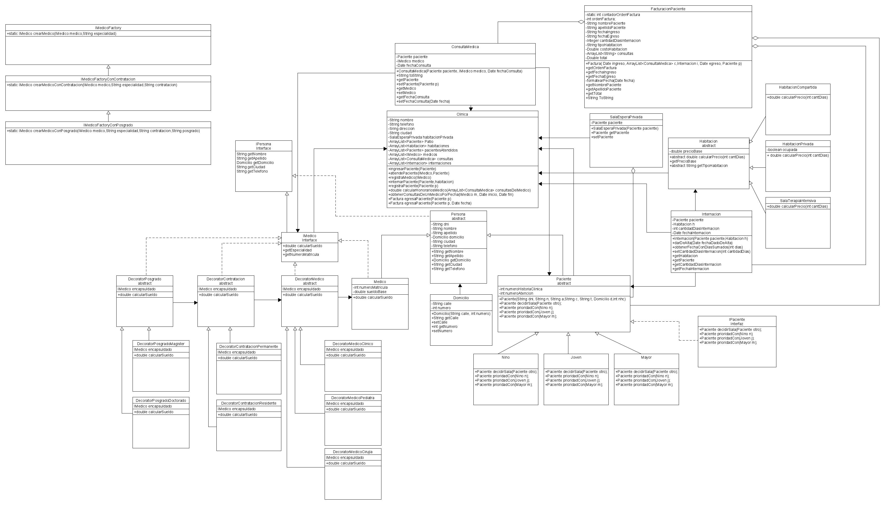

# Proyecto java clinica

Proyecto de Java para Programación C (Equipo 10)  
Integrantes:  
- Ganduglia Ciro Exequiel  
- Pezzi Esteban  
- Stufano Nazareno  
- Fernandez Ordoqui Julian Agustin  
- Teruel Lopez Leonel  

---

<a href="https://www.canva.com/design/DAG1bc5mc_M/bYvIPiBmYv0sOEgXLz_HVQ/edit?utm_content=DAG1bc5mc_M&utm_campaign=designshare&utm_medium=link2&utm_source=sharebutton">Link al informe (temporal) 
</a>

**UML Proyecto Clínica Parte 1**  
(Haz clic para verlas en tamaño completo 👇)

  

**UML Proyecto Clínica Parte 2**  

  

